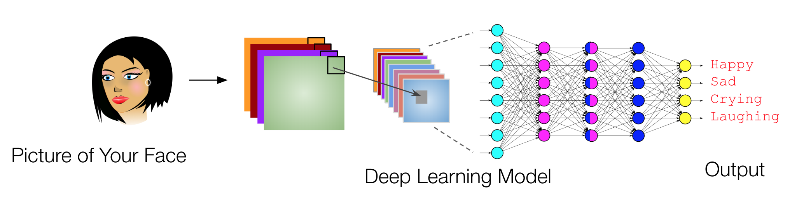

# Project Objectives
1. Design, implement, debug, evaluate, and benchmark deep convolutional neural network architectures (and/or its variants) for a dataset created and curated by yourself with at least a 1000 images (NO pre-cleaned datasets, but you can collect images from the internet).
1. Compare performance with a basic basic fully convolutional neural network model with a few filters and one or two layers.
1. Study the effect of data augmentation, regularization, and transfer learning.

# Project Expectations
1. You will work on your projects individually (i.e. group submissions are not allowed).
1. All reports including the final report must be prepared using <a href="https://www.overleaf.com/">Overleaf</a>.
1. Each of you will review at least two reports of the peers in your group.

# Project Phases

## 1. Data preparation
1. Collect the images or take pictures
1. Crop/resize them all to same dimensions (height = width)
1. Visualize sample images and discuss the distribution of output labels
1. Discuss data normalization

**What to submit?**  
a) A link to your Colab notebook (make sure that anyone with the link can view)  
b) A PDF report describing your findings  

## 2. Build an overfitting model
1. Build a large model (with many filters and many layers) to obtain close to 100% accuracy
1. Study the performance when the number of filters and layers are increased
1. If you provide the output as the input (as an additional channel) what is the smallest architecture you need to overfit the data?
1. Plot your learning curves and include them in your report

**What to submit?**  
a) A link to your Colab notebook (make sure that anyone with the link can view)  
b) A PDF report describing your findings  

## 3. Split and evaluate on test set
1. Split your data into training, development, and test set
1. Train your model using the training set, 'Earlystop' using the validation set, and evaluate on the test set
1. Study the performance when the number of filters and layers are increased/changed
1. Plot your learning curves and include them in your report

**What to submit?**  
a) A link to your Colab notebook (make sure that anyone with the link can view)  
b) A PDF report describing your findings  

## 4. Effects of augmentation
1. With the best model obtained from the previous step, apply various techniques of data augmentation (Image generators) and study the improvement in accuracy
1. Plot your learning curves and include them in your report

**What to submit?**  
a) A link to your Colab notebook (make sure that anyone with the link can view)  
b) A PDF report describing your findings  

## 5. Effects of regularization
1. With the best model obtained from the previous step, apply various techniques of regularization (Batchnormalization, Dropout, L2 regularization, etc.) and study the improvement in accuracy
1. Plot your learning curves and include them in your report

**What to submit?**  
a) A link to your Colab notebook (make sure that anyone with the link can view)  
b) A PDF report describing your findings  

## 6. Use pretrained models and recent architectures 
1. Use pretrained models such as VGG16 or ResNet50 and retrain using your dataset.
1. Use recent architectures such as ResNet, DenseNet, or NASNet to train a model and study the improvement in accuracy
1. Plot your learning curves and include them in your report

**What to submit?**  
a) A link to your Colab notebook (make sure that anyone with the link can view)  
b) A PDF report describing your findings  

## 7. Poster presentation (final exam)
* Prepare a poster highlighting the problem, diagrams, your results, plots, etc.
* Poster and final report will be evaluated based on all the criteria above.
* Report and poster presentation grades will be average of (a) grades by the course instructor (b) peer grades, and (c) grades by external visitor/s from industry
* See sample-reports folder and sample-posters folder for samples

**What to submit?**  
a) A copy of your final report  
b) A link to your final Notebook

**What to bring?**  
a) A printed copy of your final report  
b) A link to your final Notebook
c) Your poster  
d) A laptop for demonstration (if needed)  

## Example Project
The goal in this project is to develop a convolutional neural network model that can identify my mood looking at a picture of my face. Take 1000 pictures of your face in various settings - 200 smiling, 200 laughing, 200 sad, 200 crying, and 200 neutral. Then, tagged each of those pictures manually. Next, randomly spit the data into - 600 pictures for training, 200 for validation, and 200 for testing. Crop images to 256 x 256 dimensions. Write a Python matplotlib code to visualize all the 1000 images. Next, build a single layer CNN model with 64 filters. Data augmentation could significantly improve the performance. The 5-class accuracy of a random classifier is 20% (baseline for the project). [Here](https://github.com/jnkx9c/DL_Project) is an actual project by Jeff Killgore, a student who took this course in Spring 2019.

