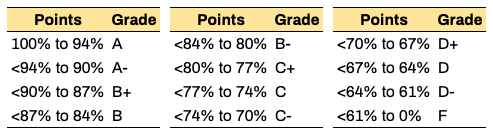

## Syllabus of Deep Learning (CMPSCI 4390/5390) - 2020 Spring

[UMSL Academic Calendar](https://www.umsl.edu/services/academic/publications/calendar/academic%20calendar%202019-2020.pdf) | [Resources & Support](https://umsl.instructure.com/courses/44471/pages/student-resources-and-supports?module_item_id=454221) | [Technology Assistance](https://umsl.instructure.com/courses/44471/pages/technology-assistance?module_item_id=454223) | [Final Exam Schedule](https://www.umsl.edu/~registration/final-exams.html)

## Class and office hours
* Instructor: [Badri Adhikari](http://umsl.edu/~adhikarib) | [adhikarib@umsl.edu](mailto:adhikarib@umsl.edu)
* Class meets: `TuTh 6:55PM to 8:10PM`~~at `Clark Hall 306`~~
* Office location and hours: by email ~~`312 Express Scripts Hall`, `Mondays 1PM to 4PM`~~

## About the course
* Deep learning is popular because of its high applicability and superior performance in domains where we use machine learning. Deep learning based applications have reached or surpassed human performance not only for industrial problems like object classification, speech recognition, and stock market prediction but also for many problems in the field of biology and medicine. Recently, deep learning is demonstrated to outperform human radiologists in detecting pneumonia from chest X-rays. It is also reliably used in iPhone-X for unlocking the phone through accurate face detection. Self-driving cars drive using the deep learning algorithms. Deep learning will soon replace humans in most domains of human mental labor. This course reviews a typical machine learning recipe, computational foundations for deep learning, and provides an introduction to deep learning of dense neural networks. The course will focus on building, training, and evaluating deep convolutional neural networks for solving various machine learning problems, particularly the ones relating to image data. At the end of the course you will also be able to differentiate what kinds of problems are best solved by deep learning algorithms and what are not, and develop your own deep learning applications. You will also learn major technology trends in deep learning and understand what makes it different from traditional machine learning.

**Catalog Description**
* This course reviews a typical machine learning recipe, mathematical foundations for deep learning, and provides an introduction to deep learning. Topics include dense neural networks, convolutional neural networks, and recurrent neural networks. The course will cover building, training, and using deep neural networks for solving various machine learning problems like image classification and protein contact prediction. Credit cannot be granted for both CMP SCI 4390 and CMP SCI 5390. \[3 credit units\].

**Upon completing the course students will be able to:**
* Write Numpy and Tensorflow programs for building deep learning applications
* Learn computational foundations of machine learning and deep learning
* Learn the major technology trends in deep learning such as convolutional neural networks, residual neural networks, and capsule networks
* Understand what makes deep learning different and powerful compared to traditional machine learning practices
* Understand the parameters and hyper-parameters in a deep neural network
* Design, develop, train, debug, and evaluate deep neural networks
* Learn how to transfer the knowledge in pre-trained deep learning models to build models for new datasets

## Prerequisites  
* CMPSCI 3130 (Design and Analysis of Algorithms) or Graduate Standing in CS

## Course materials  
* This syllabus has the links to all the course materials.

## Textbook  
* Primary textbook: "Deep Learning with Python" by François Chollet by [Manning](https://www.manning.com/books/deep-learning-with-python); [pdf](http://faculty.neu.edu.cn/yury/AAI/Textbook/Deep%20Learning%20with%20Python.pdf); [examples](https://github.com/fchollet/deep-learning-with-python-notebooks) at GitHub 
* Reference textbooks: "[Machine Learning Yearning](https://www.deeplearning.ai/content/uploads/2018/09/Ng-MLY01-12.pdf)" by Andrew Ng and "Deep Learning" by Ian Goodfellow, Yoshua Bengio, and Aaron Courville

## Course topics

* Introduction to Python and Numpy
  - Notebooks - [Python3](notebooks/python.ipynb), [Numpy](notebooks/numpy.ipynb), [Matplotlib & Plotly](notebooks/matplotlib_plotly.ipynb)
  - Viedo lectures - [Colab](https://www.youtube.com/watch?v=PVsS9WtwVB8), [Python3](https://youtube.com/watch?v=V42qfAPybp8), [Numpy](https://www.youtube.com/watch?v=Omz8P8n-5gY), [Matplotlib & Plotly](https://youtu.be/aIzkkjRzVdA)
  - "[From Python to Numpy](https://www.labri.fr/perso/nrougier/from-python-to-numpy/)" and "[100 numpy exercises](https://github.com/rougier/numpy-100/blob/master/100_Numpy_exercises.ipynb)" by Nicolas P. Rougier

* Introduction to deep learning - [slides](https://docs.google.com/presentation/d/12xzql-fPXfoecYB0UWL8KCvkTP-OO_UH3R9-c_yPxgg/edit?usp=sharing)
  - Sections 1.1, 1.2, 1.3, and 4.1

* Data representations & tensor operations - [slides](https://docs.google.com/presentation/d/1jFkusgXRn05_slfSVBRkVxyNa3n7U1rQJa5vS8QwSko/edit?usp=sharing)
  - Sections 2.2, 2.3, and 2.4

* Introduction to Keras - [slides](https://docs.google.com/presentation/d/1uiI-RN9ThSXe1zpXu30INXqPUoUJaCVGFAwYF5jtlto/edit?usp=sharing)
  - Sections 3.2 and 3.3

* Training must stop - [slides](https://docs.google.com/presentation/d/1DEU6qG_xZE6wpAJDaOL7yLWuoyljZv2EER1cbY9kObo/edit?usp=sharing)

* Feed-forward neural networks - [wine_quality.ipynb](./notebooks/wine_quality.ipynb)

* Preparing images for deep learning - [slides](https://docs.google.com/presentation/d/1syD38eJp6aBnwuCWXNv7yrxhdn3U_KwQKvpo90ZDeNI/edit?usp=sharing) / [notebook](./notebooks/Image_preprocessing.ipynb)
  - Sections 3.6.2, 5.2.4, and 5.2.5

* The convolution operation - [slides](https://docs.google.com/presentation/d/1uesCp63vUgzrgROJ7c3VfA5VyCR17W6czayhnWHj9AI/edit?usp=sharing) / [notebook](./notebooks/Detect_rectangles.ipynb)
  - Section 5.1.1

* Activations & loss functions - [slides](https://docs.google.com/presentation/d/17Gx0Iaov1MuNRXWHAeIUQvz0wpdKWTaIAVQVyRrt-cs/edit?usp=sharing)
  - Section 4.5.5, and Table 4.1
 
* Classify MNIST digits using a CNN - [notebook](./notebooks/MNIST_v1.ipynb)

* Evaluating models - [slides](https://docs.google.com/presentation/d/1g8rzgspsYU90QtSV99hcA2_ojxJMwRdcw7KK55KNyMA/edit?usp=sharing)
  - Sections, 4.2, 4.2.1, 4.2.2 

* Feature engineering - [slides](https://docs.google.com/presentation/d/14k2vUTlJThQ0u8RVc0C68_92K1Df5YW0v85C5w3nFe8/edit?usp=sharing)
  - Section 4.3

* Overfitting, underfitting, & regularization - [slides]
  - Sections 4.4, 4.4.1, 4.4.2, and 4.4.3

* Convolutional NN architectures - [slides] [video lecture]
  - Sections 5.1.1, 5.1.2, and 7.1
  - Padding and Max-pooling
  - Classic architectures
  - Residual networks
  - Inception network & GoogLeNet
  - DenseNet and NASNet

* Workflow of machine learning - [slides]
  - Sections 4.5, 4.5.5, 4.5.6, and 4.5.7

* Transfer learning - [slides]
  - Section 5.3, 5.3.1, and 5.3.2

* Capsule networks - [slides]

* GPUs for deep learning
  - Discussion: GPU battle

* Protein distance prediction - [slides]

* Explainable models - [slides]
  - Section 5.4

* Deep learning practices - [slides]
  - Sections 7.1.2, 7.1.3, 7.1.4, and 7.1.5

* Limitations of DL & conclusions - [slides]
  - Section 9.2

## Course schedule
* Detailed course schedule is [here](https://docs.google.com/spreadsheets/d/e/2PACX-1vRF6jdD5-whvlX-1mbKLpnryHVr8dIcKUbJcfg-Kx6WH7PkiXNRgLwyaQFO8svZWfxtaccjYpef0mpm/pubhtml?gid=1410243905&single=true).

## General policies
* Keep yourself out of plagarism; Read [UMSL's Policy](https://www.umsl.edu/services/academic/policy/academic-dishonesty.html); Our `turnitin` tool automatically checks for plagarism; Here is an [example](syllabus/turn-it-in.png).
* Lecture recordings, audio or video, are not permitted
* You are welcome to bring your laptop in class

## Programming language
* Python3 is language for the course; you are expected to use Python3 for all of your classroom activities, homeworks, and project.
* You are also required to use [Google colab](https://colab.research.google.com) or your own hosted Jupyter Notebook for running your programs.

## ~~Late policy~~  
* You have a total of 5 late days.
* Once you use your late days, late submissions will get no points.

## Course project
* See [here](PROJECT.md).

## Homeworks
* There will be two kinds of homeworks: 1) writing chapter section summaries, and 2) project milestones.
* For chapter summary homeworks you will submit a one page summary (at least 500 words) of the chapter sections.
* All text must be "in your own words" and anything copied must be quoted and cited appropriately.
* All reports including the final report must be prepared using <a href="https://www.overleaf.com/">Overleaf</a>.
* For project homeworks, see the project section.

##~~Presentations~~
* See [here](PRESENTATIONS.md).

##~~Tests~~
* There will be short tests (maximum 30 minutes) almost every week on Thursdays (see the course schedule).
* On the tests, you may be asked to find the output of a program/code-block but not to write complete programs.
* If you miss a test (on topic A) and send me an email by the end of next day with a valid reason, your score in the next test (on topic B) will be copied as your score for the test you missed. However, in the test that you appear, you may be asked questions from both topics (A and B) while all others will receive questions only on topic B.
* Tests will be CLOSED book, CLOSED notes, and CLOSED electronics.
* Use of any type of electronics is strictly forbidden during tests.
* It is your responsibility to contact the instructor if you miss a test. If you don't, a grade of zero points will be assgined for the test you miss.

##~~Attendance~~
* Attendance will be recorded frequently
* More than 5 uninformed absenses may lead to failing the course  (This requirement is waived due to the COVID-19)
  
## Grade composition  
* Before spring break:
  * 10 Tests → 10 * 3 points
  * 10 Homeworks → 10 * 2 points
  * 3 Presentations → 3 * 3.34 points
  * 1 Project → 40 points
  * 1.5 bonus point to everyone in the class if 80%+ complete the course evaluation survey
* After spring break

#### Project (40 points)
* 2.5 points → Data preparation
* 2.5 points → Build an overfitting model
* 5  points → Split & evaluate on test set
* 5  points → Effects of augmentation
* 5  points → Effects of regularization
* 5  points → Addressing of peer-review comments
* 5  points → Use pretrained & residual archs
* 10 points → Report ~~and poster presentation (score from external judges, peers, and instructor)~~

## Grading scheme  
* The university may provide you with an option to switch to S/U grade.
  

