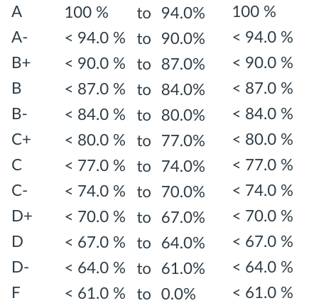

## Deep Learning - CMP SCI 4390/5390
## Syllabus - 2019 Spring

[Academic Calendar](https://www.umsl.edu/services/fa/telephone-directory/academic_calendar.pdf) | [Resources & Support](https://umsl.instructure.com/courses/44471/pages/student-resources-and-supports?module_item_id=454221) |  [Technology Assistance](https://umsl.instructure.com/courses/44471/pages/technology-assistance?module_item_id=454223) | [Final Exam Schedule](https://www.umsl.edu/~registration/final-exams.html) | [Spring 2019 - All Courses](https://www.umsl.edu/~registration/students/sp19-pdf.pdf) 

## About the Instructor
* Name: Badri Adhikari
* Email: adhikarib@umsl.edu (Use your UMSL email account to send me emails)
* Office Hours: Tuesdays from 6:45 PM to 8:15 PM & Thursdays from 2:30 PM to 4 PM
* Office Location: 312 ESH
* Homepage: [https://badriadhikari.github.io](https://badriadhikari.github.io)

## About the Course

Deep learning is popular because of its high applicability and superior performance in domains where we use machine learning. Deep learning based applications have reached or surpassed human performance not only for industrial problems like object classification, speech recognition, and stock market prediction but also for many problems in the field of biology and medicine. Recently, deep learning is demonstrated to outperform human radiologists in detecting pneumonia from chest X-rays. It is also reliably used in iPhone-X for unlocking the phone through accurate face detection. Self-driving cars drive using the deep learning algorithms. Deep learning will soon replace humans in most domains of human mental labor. This course reviews a typical machine learning recipe, mathematical foundations for deep learning, and provides an introduction to deep learning. Topics include dense neural networks, convolutional neural networks, and recurrent neural networks. The course will cover building, training, and using deep neural networks for solving various machine learning problems like image classification and crime prediction. At the end of the course you will be able to differentiate what kinds of problems are best solved by deep learning algorithms and what are not. You will also be able to develop your own deep learning applications for solving problems of your choice.

**Prerequisites**
* CMP SCI 3130 (Design and Analysis of Algorithms) or Graduate Standing in CS

**Catalog Description**
* This course reviews a typical machine learning recipe, mathematical foundations for deep learning, and provides an introduction to deep learning. Topics include dense neural networks, convolutional neural networks, and recurrent neural networks. The course will cover building, training, and using deep neural networks for solving various machine learning problems like image classification and protein contact prediction. Credit cannot be granted for both CMP SCI 4390 and CMP SCI 5390. \[3 credit units\].

**This course aims to:** 
* Revise the recipe for machine learning and introduce deep learning
* Explain what makes deep learning powerful compared to traditional machine learning methods 
* Cover the basic mathematical foundations of deep learning such as vector operations 
* Introduce the various flavors of deep learning such as dense neural networks, convolutional neural networks, and recurrent neural networks 
* Delve into building, training, and using deep neural networks for solving various machine learning problems such as image classification and protein contact prediction
* Cover how a deep learning architectures actually work and how to debug 

**Upon completing the course students will be able to (Learning Outcomes):** 
* Learn mathematical foundations for deep learning 
* Learn the major technology trends in deep learning 
* Understand what makes deep learning different from traditional machine learning 
* Understand the parameters in a deep neural network architecture 
* Build, train, and use deep neural networks

**Class meets**
* TuTh 4 PM to 5:15 PM at SSB 218

**Course Materials**
* Slides, Project Requirements, Tests, and Samples are inside the relevant folders

**Textbooks**
* "Deep Learning with Python" (DLP) by François Chollet 
* "Machine Learning Yearning" (MLY) by Andrew Ng [pdf](https://www.deeplearning.ai/content/uploads/2018/09/Ng-MLY01-12.pdf)
* "Deep Learning" (DL) by Ian Goodfellow, Yoshua Bengio, and Aaron Courville               

## Course Schedule
This schedule will be updated as the class progresses.  

| `Week` | `Day` | `Date` | `Topic` | 
| --- | --- | --- | --- | 
| 01 | 01 | Jan 22, Tue | Syllabus; Python and Numpy Tutorial up to 'List comprehensions' |
| 01 | 02 | Jan 24, Thu | Python and Numpy Tutorial |
| 02 | 03 | Jan 29, Tue | Visual Guide to NNs; XNOR funtion; Training, Dev & Test Sets |
| 02 | 04 | Jan 31, Thu | Lab on Python, Numpy and Keras (Class at ESH 00005) |
| 03 | 05 | Feb 05, Tue | Review of Syllabus & Discuss Test Samples; 05_NNs_for_Classification.ipynb |
| 03 | 06 | Feb 07, Thu | 06_NNs_for_Regression.ipynb; Intro to CNNs |
| 04 | 07 | Feb 12, Tue | 08_Digit_Image_Classification_MNIST.ipynb |
| 04 | 08 | Feb 14, Thu | Revision for Test |
| 05 | 09 | Feb 19, Tue | XGBoost Library; Module II Slides 1 to 22 |
| 05 | 10 | Feb 21, Thu | TEST |
| 06 | 11 | Feb 26, Tue | Module II Slides 23 to 36 |
| 06 | 12 | Feb 28, Thu | Project Requirements; Module II Slides 37 to 52 |
| 07 | 13 | Mar 05, Tue | Module II Slides 53 to 72 |
| 07 | 14 | Mar 07, Thu | Discussion of Project Ideas; Module II Slides 73 to 74 |
| 08 | 15 | Mar 12, Tue | Module II Slides 75 to 98 |
| 08 | 16 | Mar 14, Thu | Module II Slides 99 to 116 |
| 09 | 17 | Mar 19, Tue | Module II Slides 99 to 127 |
| 09 | 18 | Mar 21, Thu | Module II Slides 128 to END |
| - | - | - | Spring Recess |
| 10 | 19 | Apr 02, Tue | Module III Slides 1 to 11 |
| 10 | 20 | Apr 04, Thu | Student Presentations of NIPS 2017 Papers |
| 11 | 21 | Apr 09, Tue | No Class (prepare.ai) |
| 11 | 22 | Apr 11, Thu | Module III Slides 12 to 23 |
| 12 | 23 | Apr 16, Tue | Module III Slides 24 to 35 |
| 12 | 24 | Apr 18, Thu | Student Presentations of NIPS 2018 Papers |
| 13 | 25 | Apr 23, Tue | Module III Slides 36 to 47 |
| 13 | 26 | Apr 25, Thu | Module III Slides 48 to 65 |
| 14 | 27 | Apr 30, Tue | Plan: Module III Slides 67 to END |
| 14 | 28 | May 02, Thu | Project Code and Report Due |
| 15 | 29 | May 07, Tue | No Class (conference travel) |
| 15 | 30 | May 09, Thu |  |
| - | - | - | (Final Exam) Poster Presentation on Tuesday, 14 May 02:45 – 04:45 PM |  

## Course Topics

**Module I: Introduction to Machine Learning (will conclude with ‘the’ test)**  
* Python and Numpy Basics  
* Feedforward NNs and CNNs using Keras 

**Module II: Fundamentals of Deep Learning**  
* Deep Learning and its Mathematical Building Blocks (Ch1 & Ch2 in DLP)  
* Getting Started with Neural Networks (Ch3 in DLP)  
* Fundamentals of Machine Learning (Ch4 in DLP)  
* Machine Learning Basics (Ch5 of DL)  

**Module III: Convolutional Neural Networks**  
* Deep Learning for Computer Vision (Ch5 in DLP)
* Different Types of CNNs
* Convolutional Networks (Ch9 in DL)
* Residual Neural Networks
* Transfer Learning - Existing architectures - U-net, Resnet, VGGNet, etc.
* Hardware for Deep Learning / GPUs

**Module IV: Deep Learning in Practice**  
* Deep Learning for Text and Sequences (Ch6 in DLP)
* Advanced Deep Learning Practices (Ch7 in DLP)
* Advanced Deep Learning Practices (Ch7 in DLP)
* Generative Deep Learning (Ch8 in DLP)
* Unsupervised Learning
* Regularization for Deep Learning (Ch7 in DL)
* Optimization for Training Deep Models (Ch8 in DL)
* Sequence Modeling: Recurrent and Recursive Nets (Ch10 in DL)

**Module V: Limitations and Future of DL**  
* The Backpropagation Algorithm
* Limitations and Future of DL (Ch9 in DLP)

**[If Time Permits] Module VI: Review of Concepts in Deep Learning**  
* Setting up Development and Test sets (Ch5 to Ch11 in MLY)  
* Basic Error Analysis (Ch13 to Ch18 in MLY)  
* Bias, Variance, and Learning Curves (Ch20 to Ch32 in MLY)  
* Training and Testing on Different Distributions, & Debugging Inference Algorithms (Ch36 to Ch46 in MLY)  
* End-to-end Deep Learning & Error Analysis by Parts (Ch47 to Ch57 in MLY)  

## Course Policies
**General**
* Keep yourself out of plagarism - Read [UMSL's Policy](https://www.umsl.edu/services/academic/policy/academic-dishonesty.html)
* Lecture recordings, audio or video, are not permitted
* You are welcome to bring your laptop in class

**Test** 
* There will be one Test (yes, only one test)
* Test will be CLOSED book, CLOSED notes, and CLOSED electronics
* You will either need to write code on the test or predict the output of a code block

**Presentations of NIPS Papers** 
* You will choose a paper at https://papers.nips.cc/ and present it to the class
* See the folder "presentation_guidelines" for details

**Projects**
* Graduate students will work on their projects alone
* Undergraduate students can choose to work on a project alone or as a part of a two people team
* Although project may be completed by two people, grading will be done individually
* Project grades will be average of (a) grades by instructor (b) peer grades, and (c) external examiner
* Projects will conclude with (a) a small report (b) code submission, and (c) poster presentation

**Homeworks** 
* There will be no homeworks (yes, no homeworks at all)

**Late Homework Submission (applies to project code & report submission)** 
* You have a total of 5 late days
* Once you use your late days, late homework submissions will get no points

**Attendance**  
* Attendance will be recorded in every class
* You will automatically fail the course if you miss more than 5 classes

## Assessment/Grading
**Grade Composition**
* 60 points = Test
* 5 + 5 points = Paper Presentations
* 30 points = Final Project Poster & Poster Presentation
* 1 bonus point to everyone in the class if 80%+ complete the course evaluation survey

**Grading Scheme (from Canvas)**  
   

---------
#### “A Little Learning” by Alexander Pope
A little learning is a dangerous thing;  
Drink deep, or taste not the Pierian spring:  
There shallow draughts intoxicate the brain,  
And drinking largely sobers us again.  

---------
## Students' Projects
* Jeffrey's Mood Detection Project - https://github.com/jnkx9c/DL_Project/
* Andrew's Street Sign Classification Project - https://github.com/Hopding/street-sign-classifier
* Trevor's Flower Classification - https://github.com/Trevor-Parsons/DL-Semester-Project
* Cole's Dice Detector - https://github.com/ColeAlves/DiceDetector/
* Patrick and Cody's Analog-clock Time Prediction - https://github.com/pkong0414/Deep-Learning-Projects/ & https://github.com/Balfabb7/deepLearning
* Andrew's Digital Clock Project - https://github.com/andrewHosna/dl_ai_project

