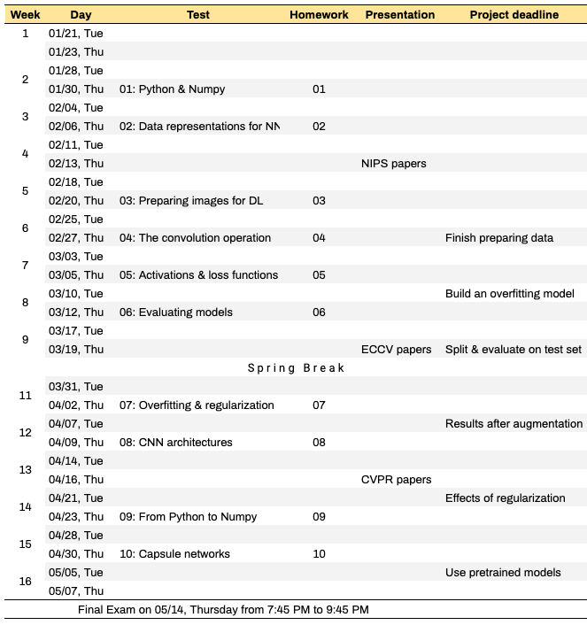

## Syllabus of Deep Learning (CMPSCI 4390/5390) - 2020 Spring

[Academic Calendar](https://www.umsl.edu/services/academic/publications/calendar/academic%20calendar%202019-2020.pdf) | [Resources & Support](https://umsl.instructure.com/courses/44471/pages/student-resources-and-supports?module_item_id=454221) |  [Technology Assistance](https://umsl.instructure.com/courses/44471/pages/technology-assistance?module_item_id=454223) | [Final Exam Schedule](https://www.umsl.edu/~registration/final-exams.html)

## Class and office hours
* Instructor: [Badri Adhikari](https://badriadhikari.github.io) | [adhikarib@umsl.edu](mailto:adhikarib@umsl.edu)
* Class meets: `TuTh 6:55PM to 8:10PM` at `Clark Hall 306`
* Office location and hours: `312 Express Scripts Hall`, `Mondays 1PM to 4PM` 

## About the course
* Deep learning is popular because of its high applicability and superior performance in domains where we use machine learning. Deep learning based applications have reached or surpassed human performance not only for industrial problems like object classification, speech recognition, and stock market prediction but also for many problems in the field of biology and medicine. Recently, deep learning is demonstrated to outperform human radiologists in detecting pneumonia from chest X-rays. It is also reliably used in iPhone-X for unlocking the phone through accurate face detection. Self-driving cars drive using the deep learning algorithms. Deep learning will soon replace humans in most domains of human mental labor. This course reviews a typical machine learning recipe, mathematical foundations for deep learning, and provides an introduction to deep learning. Topics include dense neural networks, convolutional neural networks, and recurrent neural networks. The course will cover building, training, and using deep neural networks for solving various machine learning problems like image classification and crime prediction. At the end of the course you will be able to differentiate what kinds of problems are best solved by deep learning algorithms and what are not. You will also be able to develop your own deep learning applications for solving problems of your choice.

**Catalog Description**
* This course reviews a typical machine learning recipe, mathematical foundations for deep learning, and provides an introduction to deep learning. Topics include dense neural networks, convolutional neural networks, and recurrent neural networks. The course will cover building, training, and using deep neural networks for solving various machine learning problems like image classification and protein contact prediction. Credit cannot be granted for both CMP SCI 4390 and CMP SCI 5390. \[3 credit units\].

**This course aims to:** 
* Revise the recipe for machine learning and introduce deep learning
* Explain what makes deep learning powerful compared to traditional machine learning methods 
* Cover the basic mathematical foundations of deep learning such as vector operations 
* Introduce the various flavors of deep learning such as dense neural networks, convolutional neural networks, and recurrent neural networks 
* Delve into building, training, and using deep neural networks for solving various machine learning problems such as image classification and protein contact prediction
* Cover how a deep learning architectures actually work and how to debug 

**Upon completing the course students will be able to (Learning Outcomes):** 
* Learn mathematical foundations for deep learning 
* Learn the major technology trends in deep learning 
* Understand what makes deep learning different from traditional machine learning 
* Understand the parameters in a deep neural network architecture 
* Build, train, and use deep neural networks

## Prerequisites  
* CMPSCI 3130 (Design and Analysis of Algorithms) or Graduate Standing in CS

## Learning outcomes  
* Use Python, Numpy and Keras to design, train, and evaluate basic feed-forward neural networks
* Learn an overview of artificial intelligence principles and approaches
* Learn a basic understanding of the building blocks of AI as presented in terms of intelligent agents
* Select and evaluate various searching algorithms
* Understand some of the problems and ideas in the field of natural language processing, perception, and robotics
* Learn the philosophical foundations of AI and the future of AI
* Implement various AI algorithms such as DFS, BFS, etc.

## Course materials  
* All course materials are inside the relevant folders in Github location.

## Textbook  
* Primary textbook: "Deep Learning with Python" by François Chollet by [Manning](https://www.manning.com/books/deep-learning-with-python); [pdf](http://faculty.neu.edu.cn/yury/AAI/Textbook/Deep%20Learning%20with%20Python.pdf); [examples](https://github.com/fchollet/deep-learning-with-python-notebooks) at GitHub 
* Reference textbooks: "[Machine Learning Yearning](https://www.deeplearning.ai/content/uploads/2018/09/Ng-MLY01-12.pdf)" by Andrew Ng and "Deep Learning" by Ian Goodfellow, Yoshua Bengio, and Aaron Courville

## Course topics

* Introduction to Python and Numpy
  - Notebooks - python.ipynb, numpy.ipynb, matplotlib-pyplot.ipynb
  - Viedo lectures - python, numpy, matplotlib & pyplot
  - "[From Python to Numpy](https://www.labri.fr/perso/nrougier/from-python-to-numpy/)" and "[100 numpy exercises](https://github.com/rougier/numpy-100/blob/master/100_Numpy_exercises.ipynb)" by Nicolas P. Rougier

* Introduction to deep learning - slides
  - Section 1.1, 1.2, 1.3, and 4.1

* Data representations for NN
  - Section x.c of DLP

* Introduction to Keras

* Feed-forward NN
  - Wine quality prediction
  - Discussion: Feed-forward NN (visual guide + first NN step by step)

* Deep learning practices

* Image loading and processing
  - Normalization
  - Agumentation
  - Image data generator
  - Section 5.2.4
* The convolution operation
  - Concept of convolution, dilated convolutions, separable convolutions
  - Activity: Training one convolution filter
* Activations & loss functions & Regression vs Binary
* Learning to classify digits using filters
* Training, dev, and test set & Apply to MNIST
* Evaluating ML models (4.2)
* Feature engineering and feature learning
* Overfitting and underfitting
* Regularization
* CNN architectures
  - Padding and Max-pooling
  - Classic architectures
  - Residual networks
  - Inception network & GoogLeNet
  - DenseNet and NASNet
* The universal workflow of ML
* Transfer learning
* Capsule networks
* GPUs for deep learning
  - Discussion: GPU war + Multi-GPU training
* Protein distance prediction
* Explainable models
* Limitations of DL and conclusion

## Course schedule

* Detailed course schedule is [here](https://docs.google.com/spreadsheets/d/e/2PACX-1vRF6jdD5-whvlX-1mbKLpnryHVr8dIcKUbJcfg-Kx6WH7PkiXNRgLwyaQFO8svZWfxtaccjYpef0mpm/pubhtml?gid=1410243905&single=true).

## General policies
* Keep yourself out of plagarism; Read [UMSL's Policy](https://www.umsl.edu/services/academic/policy/academic-dishonesty.html); Our `turnitin` tool automatically checks for plagarism; Here is an [example](syllabus/turn-it-in.png).
* Lecture recordings, audio or video, are not permitted
* You are welcome to bring your laptop in class

## Programming language
* Python3 is language for the course; you are expected to use Python3 for all of your classroom activities, homeworks, and project.
* You are also required to use [Google colab](https://colab.research.google.com) or your own hosted Jupyter Notebook for running your programs.

## Late policy  
* You have a total of 5 late days.
* Once you use your late days, late submissions will get no points.

## Course project
* Project and requirements are described [here](PROJECT.md).

## Homeworks

## Tests 
* Tests will be CLOSED book, CLOSED notes, and CLOSED electronics.
* Use of any type of electronics is strictly forbidden during tests.

## Attendance  
* Attendance will be recorded frequently
* More than 5 uninformed absenses may lead to failing the course

## Grade composition  
#### Project (40 points)
* 10  points = Data analysis & preparation
* 10  points = Model selection & evaluation
* 5  points = Feature importance and reduction
* 5  points = Addressing peer-reviews
* 10 points = Poster presentation (score from external judges, peers, and instructor)

## Grading scheme  

