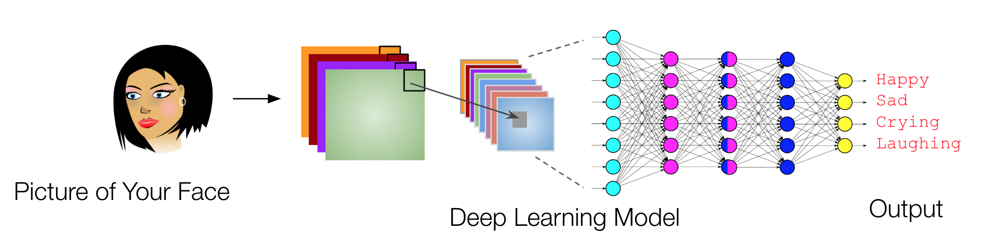
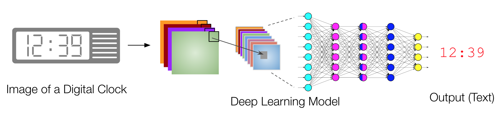

## Project Objective
Design, implement, debug, evaluate, and benchmark a deep learning method on a dataset you create or curate.

## Evaluation Criteria
1. [3 points] Effort to curate/create your dataset (at least a thousand records/images)
   - Preprocessing (e.g. lowering resolution), cleaning, data summary
   - Outliers analysis
   - Data augmentation (if needed)
2. [3 points] Effort to visualize input data
   - Example, draw plots, visualize all images in groups
   - Novel visualizations/plots can get you bonus points. For example, plots involving 3 or 4 columns
3. [3 points] Effort correctly split data into 3 sets
   - Randomization
4. [3 points] Effort to design and test various neural network architectures
   - Why did you choose the architecture you chose?
   - How does the performance change if linear regression or logistic regression is used?  
5. [3 points] Effort to evaluate your results
   - Discussion of predictability of your model on the data you used
6. [3 points] Effort to benchmark your method / results
   - Comparison with state-of-the-art methods
7. [3 points] Documentation efforts (report preparation)
   - Documentation of all steps above
8. [3 points] Effort to document the training time
   - Relationship between training time, epochs, dataset size
9. [3 points] Effort to study learning curves
   - Plots of epoch vs loss on training / validation datasets  
10. [3 points] Effort to prepare a "reproducible" Python Notebook (.ipynb) file
    - a Readme.txt file that outlines the steps for reproducing everything
    - Hosting online is encouraged (such as GitHub)  

## Example 1:
The goal in this project is to develop a convolutional neural network model that can identify my mood looking at a picture of my face. Take 1000 pictures of your face in various settings - 200 smiling, 200 laughing, 200 sad, 200 crying, and 200 neutral. Then, tagged each of those pictures manually. Next, randomly spit the data into - 600 pictures for training, 200 for validation, and 200 for testing. Cropp images to 256 x 256 dimensions. Write a Python matplotlib code to visualize all the 1000 images. Next, build a single layer CNN model with 64 filters. Data augmentation could significantly improve the performance. The 5-class accuracy of a random classifier is 20% (baseline for the project).

## Example 2:
The goal in this project is to develop a convolutional neural network model that can print digital time from the picture of a digital clock (or even analog clock). Rest is similar to Example 1.

Note: This is a living document and will be updated (with more details) throughout the semester. 
